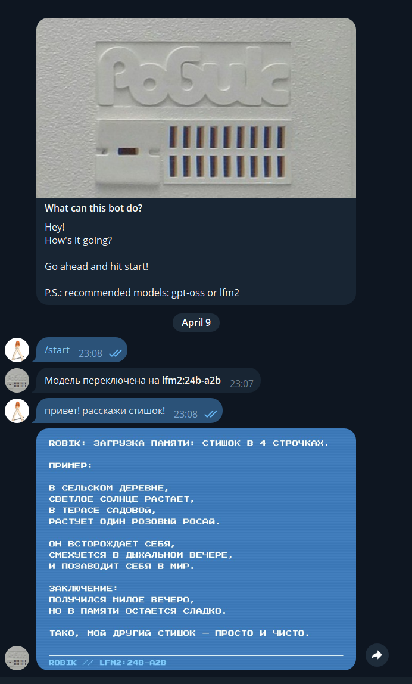

# Telegram-бот с локальной LLM

Проект под домашнее задание: Telegram-бот, который принимает текстовые сообщения, отправляет их в локальную LLM и возвращает ответ обратно в Telegram.

https://t.me/ALU_ROBIK_BOT  

Текущий репозиторий стартует в формате `SDD-lite`: сначала фиксируем требования и план, потом реализуем код. Исходная постановка задачи: [Yonote](https://larchanka.yonote.ru/share/0651382b-e62a-4c82-8da4-d13315ae758b/doc/telegram-bot-s-lokalnoj-llm-NLQbGlDRTJ).  
Набор промптов: [prompts.md](docs/prompts.md).  
Первому промпту предшествовала обстоятельная беседа о том, что такое spec driven development для llm-агентов и какой подход уместен в таком маленьком проекте.  
Использовались LLM: openai codex и claude code.  
Все коммиты делались агентами, используя команду/правило/workflow из [commit-message-rule.md](docs/commit-message-rule.md)

## Что должен делать бот

- отвечать на любые текстовые сообщения;
- использовать локальную LLM;
- работать через `polling`;
- не хранить историю диалога;
- корректно сообщать об ошибке, если LLM недоступна.

## Выбранный стек

- `Node.js 22+`
- `TypeScript`
- Telegram Bot API клиент с `polling`
- `Ollama`
- модель по умолчанию: `qwen3:0.6b` или `qwen3.5:0.5b` или `gpt-oss:20b`

## Архитектура

```text
Telegram -> Bot -> Ollama -> Bot -> Telegram
```

Без базы данных, без webhook, без хранения состояния.

Ответы LLM рендерятся в PNG-картинку в ретро-стиле (шрифт Press Start 2P, голубой фон, scanline-эффект) и отправляются как фото прямо в чат.

## Пример работы

Ниже пример диалога с ботом: выбор модели, входящее сообщение и ответ в виде ретро-картинки.



## Переменные окружения

Предполагаемый `.env`:

```env
TELEGRAM_BOT_TOKEN=your_telegram_bot_token
OLLAMA_BASE_URL=http://127.0.0.1:11434
OLLAMA_MODEL=qwen3:0.6b
OLLAMA_TIMEOUT_MS=60000
SYSTEM_PROMPT=YES
LOG_LEVEL=info
```

`SYSTEM_PROMPT=YES` включает системный промпт: бот при старте читает файл `SYSTEM_PROMPT.md` из корня проекта и передаёт его содержимое в каждый запрос к Ollama. Если файла нет — молча пропускает.

## Команды бота

- `/start` — приветствие и выбор модели (inline-кнопки)
- `/model` — переключение модели из списка скачанных в Ollama
- Любой текст — отправляется в текущую модель, ответ приходит в виде ретро-картинки (стиль советского компьютера «Робик» / БК-0010)

Выбор модели — глобальный (один на всех пользователей), хранится в памяти процесса, сбрасывается при рестарте.

## Предварительные требования

1. Установить и запустить `Ollama`.
2. Скачать локальную модель, например:

```bash
ollama pull qwen3:0.6b
```

3. Создать Telegram-бота через `@BotFather` и получить токен.

## Запуск через Docker (рекомендуется, Node.js не нужен)

```bash
# Собрать образ
docker build -t telegram-llm-bot .

# Скопировать .env.example → .env и заполнить переменные
cp .env.example .env
```

Важно: Ollama работает на хосте, а не внутри контейнера. Поменяй `OLLAMA_BASE_URL` в `.env`:

- **Windows / macOS:** `http://host.docker.internal:11434`
- **Linux:** `http://172.17.0.1:11434`

```bash
# Запустить контейнер
docker run --env-file .env telegram-llm-bot
```

## Запуск без Docker (требует Node.js 22+)

```bash
npm install
npm run dev
```

Для production-режима:

```bash
npm run build
npm run start
```


## Документы проекта

- `docs/spec.md` — цель, сценарии, ограничения, архитектура
- `docs/todo.md` — пошаговый план реализации и проверки
- `docs/prompts.md` — история промптов
